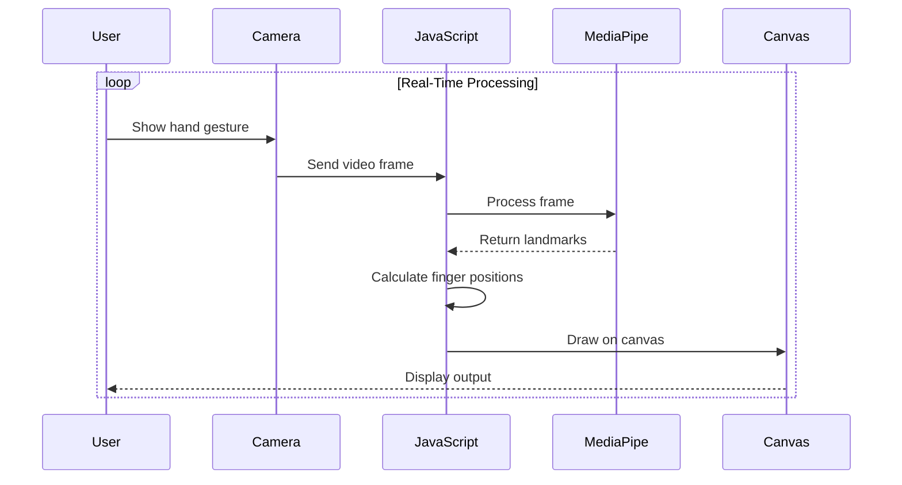

<div align="center">
  <h1 style="margin:0;">
    
    FingerVision
  </h1>
  <p><b>Real-Time Hand Tracking & Computer Vision Web Application</b></p>

  <p>
    <a href="https://8ernity.github.io/finger-vision/"><strong>Explore Live Demo »</strong></a>
    <br />
    <br />
    <a href="#features">Features</a>
    ·
    <a href="#system-architecture">Architecture</a>
    ·
    <a href="#project-structure">Project Structure</a>
    ·
    <a href="#getting-started">Getting Started</a>
  </p>
</div>

---

##  What is FingerVision?

FingerVision is a highly interactive, futuristic **real-time hand tracking web application** powered by AI. It utilizes device webcams and computer vision (via MediaPipe) to detect, map, and track hands and individual fingers with zero noticeable latency.

Whether you want to build gesture-controlled interfaces, AR/VR experiments, or simply draw in thin air like magic, FingerVision provides the foundational computer vision logic and a gorgeous, glassmorphic UI to get started.

---

##  Features

- 🖐 **Real-time AI Tracking:** Utilizes MediaPipe Hands to instantly detect 21 3D landmarks per hand.
- 🔢 **Intelligent Finger Counting:** Dynamically calculates which fingers are extended on both left and right hands.
- 🎯 **Precision Coordinates:** Displays live X/Y tracking percentages for your index fingertips.
- ✏️ **Air Drawing Mode:** Toggle a drawing mode to paint on a digital canvas using just your finger in the air.
- 🎨 **Modern Cyber-Aesthetics:** Built with a stunning dark-mode UI, custom glowing elements, and responsive data panels.
- ⚡ **Optimized Performance:** Runs entirely in the browser using WebGL acceleration—no server processing required.

---

##  Tech Stack

| Technology | Purpose |
| :--- | :--- |
| **Vite** | Modern, blazing-fast frontend build tool & dev server |
| **Vanilla JS (ES6+)** | Core application logic and DOM manipulation |
| **HTML5 & Canvas API** | Rendering camera streams, skeletal overlays, and digital drawing |
| **CSS3** | Layouts, grid systems, glassmorphism, and animations |
| **MediaPipe Hands** | Pre-trained Machine Learning models for hand tracking |

---

## 🏛️ System Architecture



###  How It Works
1. The **Webcam** captures a live high-definition video stream.
2. The stream is piped into **MediaPipe**, which infers 21 distinct 3D landmarks (joints and fingertips) per hand.
3. Our custom **JavaScript** mathematically calculates whether fingers are folded or extended based on joint geometry.
4. The **Canvas UI** layers a visual skeleton and dynamic glowing data directly over the mirrored video feed in real time.

---

## 📂 Project Structure

Following modern web development best practices, the project logic is modularized for easy maintenance and scalability:

```text
Finger-vision/
├── index.html        # Main entry point and structural HTML layout
├── style.css         # All UI styling, animations, and responsive grids
├── main.js           # Core JS: Camera setup, AI processing, Canvas drawing
├── package.json      # NPM dependencies and Vite build scripts
└── README.md         # Project documentation
```

---

##  Getting Started

This project uses **Vite** for local development.

### 1. Clone the repository
```bash
git clone https://github.com/8ernity/finger-vision.git
cd finger-vision
```

### 2. Install dependencies
Ensure you have Node.js installed, then run:
```bash
npm install
```

### 3. Start the development server
```bash
npm run dev
```
Navigate to `http://localhost:5173` in your browser. The app will ask for camera permissions to begin tracking.

### 4. Build for Production
```bash
npm run build
```
This will compile and minify all assets into a `dist/` directory, ready to be deployed to Vercel, Netlify, or GitHub Pages.

---

##  Use Cases & Future Potential

- **Gesture-based UI interaction:** Scroll pages, click buttons, or navigate interfaces without touching a mouse.
- **Virtual Whiteboards:** Presenters and teachers can draw on screens seamlessly.
- **AR/VR Experimentation:** A lightweight alternative to physical VR controllers.
- **Sign Language Recognition:** Can be expanded into a Machine Learning pipeline to interpret complex gestures.

---

## 📜 License

Distributed under the **MIT License**. Free to use, modify, and distribute.

<div align="center">
  <br />
  <p>Built with ❤️ using Computer Vision</p>
</div>
