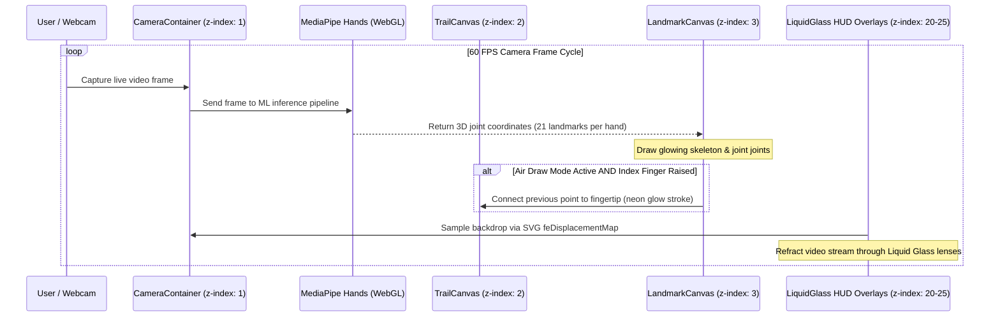

<div align="center">
  <h1 style="margin:0;">
    
    FingerVision
  </h1>
  <p><b>Real-Time HUD Hand Tracking & Apple Vision Pro Liquid Glass Interface</b></p>

  <p>
    <a href="#-features">Features</a>
    ·
    <a href="#-liquid-glass-engine">Liquid Glass Engine</a>
    ·
    <a href="#-system-architecture">Architecture</a>
    ·
    <a href="#-project-structure">Project Structure</a>
    ·
    <a href="#-getting-started">Getting Started</a>
  </p>
</div>

---

##  What is FingerVision?

FingerVision is a state-of-the-art **full-screen HUD computer vision web application** built with **React**, **TypeScript**, and **MediaPipe Hands**. It transforms your device's webcam into a futuristic, real-time hand and finger tracking interface inspired by Apple Vision Pro and iOS 18 glassmorphism.

With zero server-side latency, FingerVision detects 21 3D spatial landmarks per hand at 60 FPS, calculates dynamic finger extensions, displays live coordinate telemetry, and lets you paint glowing neon trails in thin air using precision finger gestures.

---

##  Features

- 🖐 **Full-Screen HUD Overlay:** A complete viewport camera interface featuring subtle grid scanlines, dark radial vignettes, and cyber-bracket corners.
- 💎 **Apple Vision Pro Liquid Glass:** Integrates an advanced multi-spectral SVG displacement engine (`useLiquidGlass`) that bends light around HUD cards and pills with real chromatic aberration (`chroma: 10`, `scale: -150`) and molded double-bevel specular highlights (`border-top-color`).
- 🔢 **3D Skeletal Tracking & Telemetry:** Tracks up to two hands simultaneously, calculating independent left/right finger extension states, total extended counts, and exact fingertip X/Y screen percentages.
- ✏️ **Layer-Accurate Air Drawing:** Raise your index finger while holding other fingers down to sketch vivid, glowing neon trails right on top of the live video feed. Canvases are explicitly stacked (`z-index: 1` video, `z-index: 2` air sketches, `z-index: 3` skeletal joints) for zero overlap clipping.
- 🎛️ **Spotlight HUD Cards & Dock:** Interactive `GlowCard` components that follow mouse movement with dynamic radial gradients, coupled with a floating dock for toggling drawing mode, clearing trails, and managing camera states.
- ⚡ **100% Client-Side WebGL:** Runs entirely inside your browser using hardware-accelerated WebGL and direct GPU video compositing.

---

##  Apple Vision Pro Liquid Glass Engine

FingerVision does not rely on flat, basic CSS `backdrop-filter: blur()`. Instead, it implements a volumetric optical refraction pipeline (`src/lib/liquid-glass.ts` and `public/liquid-glass.js`) modeled after cast glass lenses:

1. **Multi-Channel SVG Displacement Maps (`feDisplacementMap`):** Splits the background `SourceGraphic` into separate Red, Green, and Blue channels using staggered scale coefficients (`scale`, `scale + chroma`, `scale + 2 * chroma`).
2. **Chromatic Dispersion (`feColorMatrix` & `feBlend screen`):** Recombines the isolated RGB channels using screen blend modes to generate the authentic prismatic color separation and edge distortion seen in thick physical glass rims.
3. **Molded Specular Bevels:** Every card (`.card`, `.logo-card`, `.status-badge`, `.hud-dock`) utilizes high-index directional borders (`border-top-color: rgba(255, 255, 255, 0.45)`) and multi-layer inset shadows (`inset 0 1.5px 2px rgba(255, 255, 255, 0.75)`) to capture top lighting reflections and bottom depth anchors.

---

##  Tech Stack

| Technology | Purpose |
| :--- | :--- |
| **React 18 + TypeScript** | Component-driven UI architecture and strict type safety |
| **Vite 8** | Blazing-fast frontend dev server and production bundling |
| **MediaPipe Hands (`@mediapipe/hands`)** | Pre-trained Machine Learning models for 21-point 3D hand joint detection |
| **MediaPipe Camera Utils (`@mediapipe/camera_utils`)** | High-performance WebGL camera stream acquisition |
| **SVG Filters & Canvas 2D API** | Real-time optical liquid glass refraction and neon air sketch drawing |
| **Vanilla CSS (`style.css`)** | Custom design tokens, glassmorphic utility rules, and responsive layouts |
| **Lucide Icons (`lucide-react`)** | Clean, modern iconography for dock controls |

---

## 🏛️ System Architecture



---

## 📂 Project Structure

```text
Finger-vision/
├── index.html                           # Entry point with font imports & global liquid-glass script
├── style.css                            # Global design system, glass borders, and layer stacking rules
├── public/
│   └── liquid-glass.js                  # Global browser-safe liquid glass refraction engine
├── src/
│   ├── main.tsx                         # React root bootstrap
│   ├── App.tsx                          # Full-screen HUD layout, camera orchestration, & Air Drawing logic
│   ├── index.css                        # Base style resets and CSS variables
│   ├── components/
│   │   └── ui/
│   │       └── spotlight-card.tsx       # GlowCard component with liquid glass border upgrades
│   ├── hooks/
│   │   └── useLiquidGlass.ts            # React hook wrapper for attaching liquid glass filters
│   └── lib/
│       ├── liquid-glass.ts              # Core TypeScript liquid glass SVG displacement builder
│       └── utils.ts                     # Utility helpers (clsx/tailwind-merge)
├── package.json                         # NPM dependencies and scripts
├── tsconfig.json                        # TypeScript configuration
└── vite.config.ts                       # Vite bundler options
```

---

##  Getting Started

### 1. Clone the repository
```bash
git clone https://github.com/8ernity/finger-vision.git
cd finger-vision
```

### 2. Install dependencies
Ensure you have Node.js (v18+) installed, then run:
```bash
npm install
```

### 3. Start the development server
```bash
npm run dev
```
Navigate to `http://localhost:5173` in your browser. Click **Initialize HUD Camera** and grant camera permissions when prompted.

### 4. Build for Production
```bash
npm run build
```
This compiles and optimizes all React, TypeScript, and CSS assets into the `dist/` folder, ready for instant deployment to Vercel, Netlify, or GitHub Pages.

---

##  Air Drawing & Gesture Controls

- **Raise 1 Finger (Index Only):** Triggers air drawing mode when enabled via the bottom dock (`Air Draw` button). Traces neon lines following your fingertip across `z-index: 2`.
- **Raise All 5 Fingers:** Displays total hand extensions and real-time left/right hand coordinate percentages in the right sidebar.
- **Clear Canvas:** Click the `Clear Trail` dock button (`Trash2` icon) to erase all air sketches.
- **Stop Camera / Reset:** Click `Stop Camera` to gracefully release camera tracks and return to the standby splash screen.

---

## 📜 License

Distributed under the **MIT License**. Free to use, modify, and distribute.

<div align="center">
  <br />
  <p>Built with ❤️ using React, TypeScript, and Computer Vision</p>
</div>
